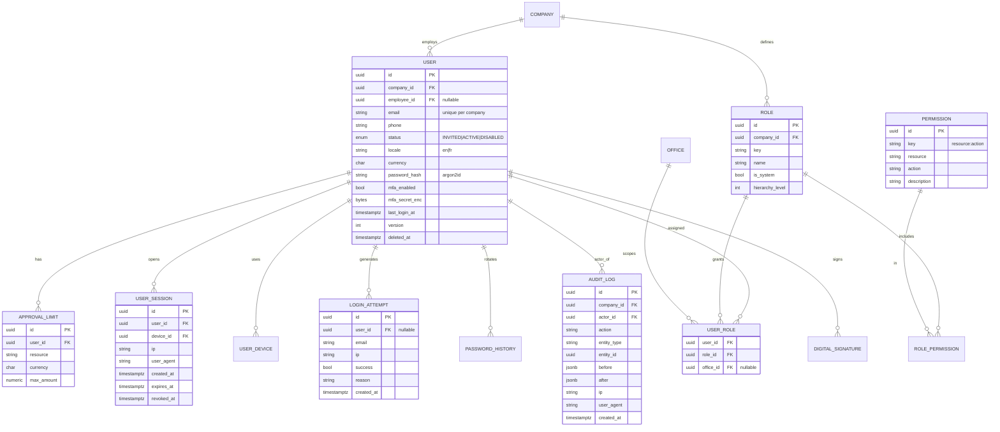

# Auth / RBAC / Users ERD (detailed)

**Notes**
- `AUDIT_LOG` and `DIGITAL_SIGNATURE` are **append-only** (enforced by trigger + revoked UPDATE/DELETE for the app role).
- `USER_ROLE.office_id` allows a role to be scoped to a specific office (e.g., "Finance Officer, Douala").
- `APPROVAL_LIMIT` is consulted by the workflow engine to route approvals upward when an amount exceeds an approver's limit.
