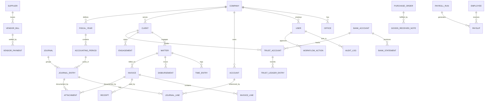

# Core ERD (high level)

Bounded contexts and their principal relationships. Rendered with Mermaid.

**Sub-ledger → GL rule:** AR (invoices/receipts), AP (bills/payments), and Trust each maintain detail and post control totals to `JOURNAL_ENTRY`/`JOURNAL_LINE`. Reconciliation asserts sub-ledger balances equal their GL control accounts.
